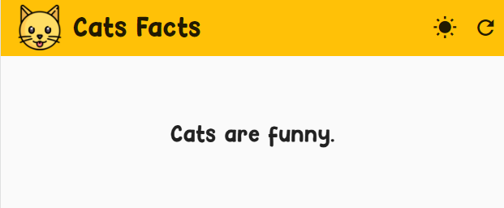

# Cats Facts - browser extension

Browser extensions with Cat Facts API (https://alexwohlbruck.github.io/cat-facts/)



## Getting Started

```
flutter run
```

or build

```
flutter build web --web-renderer html --csp
```
